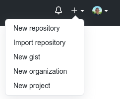
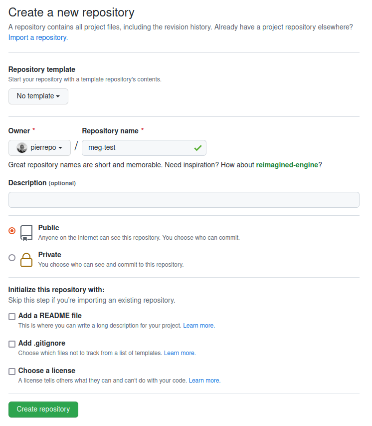
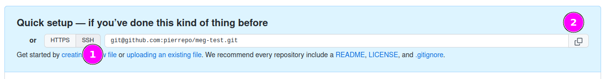
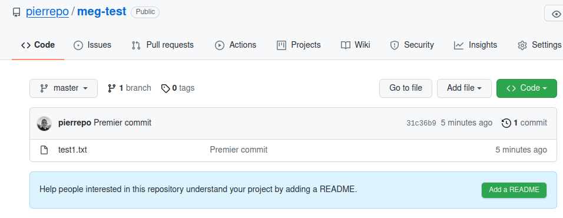
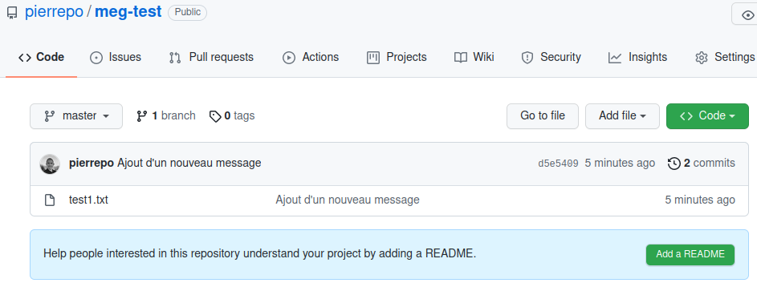
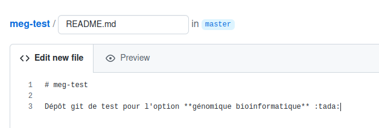
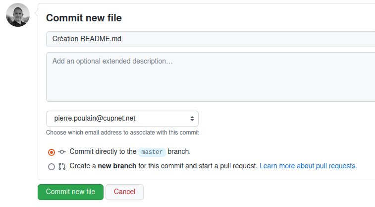
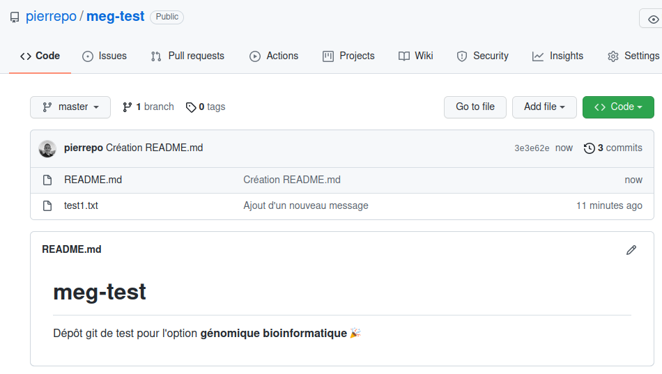

# Partie 1 : Utilisation des clés privée et publique

🔑 La combinaison de clés privée et publique est un mécanisme très sécurisé pour accéder à un serveur distant. La connexion est authentifiée par l'utilisation conjointe de la clé privée stockée sur la machine de l'utilisateur et de la clé publique stockée sur le serveur distant.

Depuis l'été 2021, GitHub interdit l'authentification par login / mot-de-passe et préconise l'utilisation de clés privée et publique.

## 1.1 Préparation

Sur adenine, lancez l'environnement `meg_m1_gb_r` que vous avez utilisé lors de la première séance.

Depuis le *Launcher*, lancez un terminal ([voir copie d'écran](img/jupyterlab_launcher_terminal.png))

Supprimez ensuite le répertoire git associé à votre environnement :

```bash
$ rm -rf .git
```

🔔 Rappels :

- Ne tapez pas le caractère `$` en début de ligne et faites attention aux majuscules et aux minuscules.
- Copiez / collez les commandes pour aller plus vite et faire moins d'erreur. Ne copiez / collez pas non plus n'importe quoi, lisez les consignes avec attention avec d'exécuter une commande.

## 1.2 Création des clés

Toujours depuis le terminal, entrez la commande suivante :

```bash
$ ssh-keygen -t rsa -b 4096 -C "connexion github adenine"
```

Validez en appuyant **4** fois sur la touche <kbd>Entrée</kbd>.

À la fin, vous devriez obtenir quelque chose du type :
```
The key's randomart image is:
+---[RSA 4096]----+
|==..  o          |
|.o+.o. o .       |
| o.+o = =        |
|o +  O . =       |
|.o o  = S +      |
|. . .o + =       |
|   +ooo =        |
|  +o+++o         |
| ..Eo++o.        |
+----[SHA256]-----+
```

Affichez maintenant le contenu du répertoire `~/.ssh/` :
```bash
$ ls ~/.ssh/
```

Vous devriez trouver :

- `id_rsa` : votre clé privée. À ne communiquer à personne ! Cette clé doit rester secrète.
- `id_rsa.pub` : votre clé publique, que vous allez déposer sur le site de GitHub.

Toujours dans votre terminal, affichez à l'écran le contenu du fichier `id_rsa.pub` :
```bash
$ cat ~/.ssh/id_rsa.pub
```

Vous devriez obtenir une clé qui ressemble à cela :
```
ssh-rsa AAAAB3NzaC1yc2EAAAADAQABAAACAQCjNrLoIXHG3NHp2eucFnOqicMz2b4I6FvjxVYMEwzO40syopxd
7YtQXzWp9EpuO7n9wWZnZ5uR6bXPqXp9VdN3MviI8PsvvjDbp4AfNz4Onunpy0mIjUarRL5evEPKI2iuqO7pUC9m
qV2tAPopsjfSuj+gBEcMAZU8gMK1o/eBqD+tpuGrNiE1Zq8PDQPOO7HStG09tZ3ABDPBSISun7GAC3ytbYJtL4A3
IEgUX1oCGbrzVGhIB0pK/xKVVpmG6KplVOjsSgYCivfOIJ05GJQk0LuizGWg1rKt4yYZgXjoMW4F+hz/+c9xnDuR
q8ZAQLBAm+NWU91Nczb5OzAfWYVY9BlES35YfcFRLuWP8ArXLHRtZJq48B7wIN39im72iYcKXcOzeyYRZQFKMb0z
9PuDrpZ6LpQZQw04i7CWJZca7Auwtd3yyC+PfuvyeuFhODqktP0rdKtTEQdrUTdaxb+K1k8FPmZMc/o91sBJ1u6d
ceccjpO1LTK/I1w9xmbQAxi0hLDCRN9hm/RUkOvzxZJed6kBzozvZ8vCi+Afv1BXjkv+jrezkkqsFl5YA01nLxyU
zo1LFBNZ41+wRHQXCQKENzsHnuVwZ0CcXRfFoZnDCn9Hs0L7kBH02O2JPbFlIVw/72XaZundqjczcp1w0gou0+Uq
TRTPvbaUnz17wffw== connexion github adenine
```

Copiez cette clé, depuis `ssh-rsa` jusqu'à `connexion github adenine` inclus.


## 1.3 Ajout de la clé publique dans GitHub

Ouvrez maintenant l'interface de gestion des clés de GitHub : <https://github.com/settings/keys>

*Authentifiez-vous si besoin.*

Cliquez sur le bouton vert « *New SSH key* ».

Indiquez comme titre « Connexion adenine » (sans les guillemets).

Collez votre clé dans le champ *Key* (tout depuis `ssh-rsa` jusqu'à `connexion github adenine` inclus).

Enfin, cliquez sur le bouton vert « *Add SSH key* ». Pour confirmer l'ajout de cette clé, GitHub vous demandera votre mot de passe utilisateur.

L'ajout d'une clé publique dans votre profile est un moyen de vous authentifier sur GitHub. Cette opération est considérée comme sensible d'un point de vue de la sécurité. Vous recevrez donc également un e-mail de GitHub pour vous informer de l'ajout de cette nouvelle clé. 

## 1.4 Test de la connexion à GitHub

Pour tester si l'enregistrement de votre clé publique dans GitHub a bien fonctionné, tapez la commande suivante dans le terminal :

```bash
$ ssh -T git@github.com
```

Si vous obtenez le message :
```
The authenticity of host 'github.com (140.82.121.4)' can't be established.
ECDSA key fingerprint is SHA256:p2QAMXNIC1TJYWeIOttrVc98/R1BUFWu3/LiyKgUfQM.
Are you sure you want to continue connecting (yes/no)?
```
Validez en tapant `yes` puis en appuyant sur <kbd>Entrée</kbd>.

Si votre clé privée a bien été enregistrée dans GitHub, vous devriez obtenir le message :
```
Hi <login>! You've successfully authenticated, but GitHub does not provide shell access.
```
Avec `<login>` l'identifiant de votre compte sur GitHub. 🎉


# Partie 2 : Premier dépôt

Dans cette partie, vous allez faire des aller-retours entre 

- GitHub, qu'on appelle le dépôt distant,
- et adenine qu'on appelle le dépôt local.

## 2.1 Création d'un nouveau dépôt sur GitHub

Dans l'interface de GitHub, tout en haut à droite, cliquez sur le symbole `+` puis sur « *New repository* » :



Indiquez ensuite *meg-test* comme « *Repository name* » :



Laissez tous les autres paramètres par défaut.

Puis cliquez sur le bouton vert « *Create repository* ».

Enfin, cliquez sur le bouton gris « *SSH* » et copiez l'adresse de connexion de votre dépôt qui débute par `git@github.com`, vous en aurez besoin pour la suite :




## 2.2 Connexion du dépôt distant à votre machine locale

Dans le terminal sur adenine, exécutez la commande suivante pour cloner votre dépôt distant (qui est sur GitHub) sur votre machine locale :

```bash
$ git clone git@github...
```

Pour l'utilisateur `pierrepo` sur GitHub, la commande complète est :
```bash
git clone git@github.com:pierrepo/meg-test.git
```

Bien sûr, il faudra adapter pour votre nom d'utilisateur.

Remarque : git pourra éventuellement se plaindre avec le message « *warning: You appear to have cloned an empty repository.* » C'est tout à fait normal, le dépôt est vide pour le moment, mais vous allez rapidement y ajouter des fichiers.

Déplacez-vous maintenant dans le répertoire créé et qui correspond à votre dépôt git :
```bash
$ cd meg-test
```

Affichez le contenu du répertoire.

Ce répertoire ne contient rien. C'est normal, votre dépôt est vide. Mais ce répertoire est un peu particulier car il contient en fait un répertoire caché `.git`. Affichez ce répertoire avec la commande :
```bash
$ ls -al
```
C'est ce répertoire qui va contenir toute la mémoire du dépôt, donc tout l'historique du dépôt. 🧐 Ne le supprimez pas.


## 2.3 Configuration du dépôt local

Avant de commencer à créer et modifier des fichiers dans votre dépôt, il faut dire à git qui vous êtes :
```bash
$ git config --global user.name "Prénom Nom"
$ git config --global user.email "moi@mail.com"
```

*Attention, adaptez le prénom, le nom et l'adresse e-mail à votre cas.*

Remarque : ces commmandes `git config` ne sont à lancer qu'une seule fois sur votre machine (même si vous avez plusieurs dépôts).

## 2.4 Exploration des commandes de base

Toujours dans votre dépôt git, créez le fichier `test1.txt` et ajoutez-y du contenu. Vous pouvez faire cela avec l'éditeur de texte de Jupyter Lab ou plus rapidement avec la commande suivante :
```bash
$ echo "une première ligne" > test1.txt
```

Si vous tapez maintenant la commande `git status` pour savoir ce qui se passe, vous devriez obtenir :

```
$ git status
Sur la branche master

Aucun commit

Fichiers non suivis:
  (utilisez "git add <fichier>..." pour inclure dans ce qui sera validé)
        test1.txt

aucune modification ajoutée à la validation mais des fichiers non suivis sont présents (utilisez "git add" pour les suivre)
```

Le fichier `test1.txt` existe bien mais il n'est pas encore pris en charge par git. Pour cela, il faut utiliser la commande `git add` :
```bash
$ git add test1.txt
```

Un nouveau `git status` renvoie alors :
```
$ git status
Sur la branche master

Aucun commit

Modifications qui seront validées :
  (utilisez "git rm --cached <fichier>..." pour désindexer)
        nouveau fichier : test1.txt
```

`test1.txt` est désormais pris en compte par git et ses modifications sont prêtes à être validées. Pour cela, nous allons créer un *commit*, c'est-à-dire une photo des fichiers :
```bash
$ git commit -m "Premier commit"
```

Vous devriez obtenir un résultat du type :
```bash
$ git commit -m "Premier commit"
[master (commit racine) a7b7006] Premier commit
 1 file changed, 1 insertion(+)
 create mode 100644 test1.txt
```

Parfait ! Il est maintenant temps d'envoyer ce premier *commit* sur GitHub :

```bash
$ git push
Énumération des objets: 3, fait.
Décompte des objets: 100% (3/3), fait.
Écriture des objets: 100% (3/3), 236 octets | 236.00 Kio/s, fait.
Total 3 (delta 0), réutilisés 0 (delta 0)
To github.com:pierrepo/meg-test.git
 * [new branch]      master -> master
```

Retournez maintenant sur votre navigateur internet et rafraichissez la page de votre dépôt sur GitHub (a priori `https://github.com/<login>/meg-test` avec `<login>` votre identifiant GitHub).

Vous devriez voir le fichier `test1.txt` ! 🥳




Depuis le terminal, modifiez une seconde fois le fichier `test1.txt` :
```bash
$ echo "et hop une deuxième ligne !" >> test1.txt
```

Visualisez les différences par rapport au *commit* précédent avec la commande
```bash
$ git diff
```

Une nouvelle ligne est marquée par le symbole `+`. Une ligne supprimée est marquée par le symbole `-`. Les lignes modifiées apparaissent avec le symbole `+` et `-`.

Exemple de résultat :
```bash
$ git diff
diff --git a/test1.txt b/test1.txt
index 0d8e693..f9f2480 100644
--- a/test1.txt
+++ b/test1.txt
@@ -1 +1,2 @@
 une première ligne
+et hop une deuxième ligne !
```

Ajoutez (encore) le fichier modifié puis créez un nouveau *commit* :
```bash
$ git add test1.txt
$ git commit -m "Ajout d'un nouveau message"
```

Et envoyez ce nouveau *commit* sur Github :
```bash
$ git push
Énumération des objets: 5, fait.
Décompte des objets: 100% (5/5), fait.
Écriture des objets: 100% (3/3), 305 octets | 305.00 Kio/s, fait.
Total 3 (delta 0), réutilisés 0 (delta 0)
To github.com:pierrepo/meg-test.git
   404b6ff..5adb360  master -> master
```

Retournez sur GitHub pour observer ce nouveau *commit* :




Depuis le terminal sur adenine, affichez l'historique avec la commande `git log` :
```bash
$ git log
commit 5adb360b9682320e4fe32382d79d9b9454d657b3 (HEAD -> master, origin/master)
Author: Pierre Poulain <pierre.poulain@cupnet.net>
Date:   Tue Apr 6 21:00:36 2021 +0200

    Ajout d'un nouveau message

commit 404b6ff031bd9ba0daa586c7a524eb8ef409ec1c
Author: Pierre Poulain <pierre.poulain@cupnet.net>
Date:   Tue Apr 6 20:52:47 2021 +0200

    Premier commit
```

Si besoin, pressez la touche <kbd>q</kbd> pour quitter le journal de git.

Vous constatez que git mémorise :

- **qui** a créé le *commit* (par exemple : *Pierre Poulain <pierre.poulain@cupnet.net>*) ;
- **quand** le *commit* a été créé (par exemple : *Tue Apr 6 21:00:36 2021 +0200*) ;
- et **pourquoi** il a été créé (par exemple : *Ajout d'un nouveau message*).

Git mémorise aussi quels fichiers ont été modifiés. Nous verrons plus tard comment les retrouver.

De plus, git attribue un identifiant à chaque *commit* (ici : `404b6ff031bd9ba0daa586c7a524eb8ef409ec1c`). Cet identifiant est unique et permet de retrouver un *commit* particulier.


## 2.5 Modification d'un fichier depuis GitHub

Depuis l'interface de GitHub, cliquez sur le bouton vert « *Add a README* »

Dans l'éditeur en ligne, ajoutez le texte suivant :
```
# meg-test

Dépôt git de test pour l'option **génomique bioinformatique** :tada:
```



En bas de la page, indiquez comme titre de *commit* : « Création README.md » (sans les guillemets), puis cliquez sur le bouton vert « *Commit new file* ».



Bravo ! Vous avez créé un nouveau *commit*, mais cette fois dans l'interface de GitHub :




Retournez dans le terminal sur adenine et synchronisez votre dépôt git local avec GitHub :
```bash
$ git pull
remote: Enumerating objects: 4, done.
remote: Counting objects: 100% (4/4), done.
remote: Compressing objects: 100% (3/3), done.
remote: Total 3 (delta 0), reused 0 (delta 0), pack-reused 0
Dépaquetage des objets: 100% (3/3), 716 octets | 358.00 Kio/s, fait.
Depuis github.com:pierrepo/meg-test
   5adb360..4c65a31  master     -> origin/master
Mise à jour 5adb360..4c65a31
Fast-forward
 README.md | 3 +++
 1 file changed, 3 insertions(+)
 create mode 100644 README.md
```

Vérifiez que le fichier `README.md` est bien présent avec la commande `ls` puis affichez son contenu :
```bash
$ cat README.md
```

Vérifiez également que le *commit* créé sur GitHub est bien enregistré dans l'historique :
```bash
$ git log
```

Si besoin, pressez la touche <kbd>q</kbd> pour quitter le journal de git.

