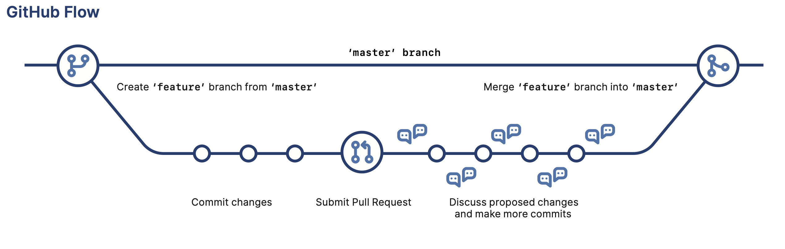

# Partie 4 : Branches

## 4.1 Création de branche

Revisionez la vidéo « [Débuter avec Git et Github en 30 min](https://youtu.be/hPfgekYUKgk?t=634) » à partir de 10'34 sur les branches.

Depuis un terminal sur adenine, revenez dans le répertoire `meg-test` :
```bash
$ cd $HOME/meg_m1_gb_r/meg-test
```

🔔 Rappels :

- Ne tapez pas le caractère `$` en début de ligne et faites attention aux majuscules et aux minuscules.
- Copiez / collez les commandes pour aller plus vite et faire moins d'erreur. Ne copiez / collez pas non plus n'importe quoi, lisez les consignes avec attention avec d'exécuter une commande.

Vérifiez que votre dépôt est « propre », c'est-à-dire qu'il ne contient pas de fichier modifié non commité.

```bash
$ git status
On branch master
Your branch is up to date with 'origin/master'.

nothing to commit, working tree clean
```

Créez une nouvelle branche, par exemple *nouveau-fichier* :

```bash
$ git branch nouveau-fichier
```

Vérifiez que cette branche existe bien :

```bash
$ git branch
* master
  nouveau-fichier
```

Le symbole `*` à gauche de *master* indique que la branche courante est *master*.

Basculez maintenant sur la branche que vous venez de créer :

```bash
$ git checkout nouveau-fichier
```

Vérifiez que vous êtes désormais sur la bonne branche :

```bash
$ git branch
  master
* nouveau-fichier
```

Le symbole `*` à gauche de *nouveau-fichier* indique que la branche courante est *nouveau-fichier*.

Créez un nouveau fichier `test2.txt` avec le texte qui vous convient :

```bash
$ echo "Nouveau fichier pour tester une branche" > test2.txt
```

Demandez ensuite à git de prendre en compte votre nouveau fichier :

```bash
$ git add test2.txt
```

Puis réalisez un premier *commit* :

```bash
$ git commit -m "Création d'un nouveau fichier"
```

Réalisez plusieurs *commits* en modifiant à chaque fois le fichier `test2.txt`, par exemple :

```bash
$ echo "Une ligne supplémentaire" >> test2.txt
$ git add test2.txt
$ git commit -m "Ajout d'une ligne"
$ echo "Et encore une !" >> test2.txt
$ git add test2.txt
$ git commit -m "Ajout d'une dernière ligne"
```

## 4.2 Fusion

Revenez sur la branche *master* et vérifiez que le fichier `test2.txt` n'est **pas** présent dans votre répertoire :

```bash
$ git checkout master
$ ls
```

Les branches fonctionnent comme des sortes de « réalités parallèles ». Il est donc normal que le fichier que vous avez créé dans la branche *nouveau-fichier* n'apparaisse pas dans la branche *master*.

Fusionnez maintenant sur la branche actuelle (*master*) la branche *nouveau-fichier* :

```bash
$ git merge nouveau-fichier
```

Vérifiez que le fichier `test2.txt` est présent et contient vos modifications :

```bash
$ ls
$ cat test2.txt
```

La branche *nouveau-fichier* ne sert plus à rien car les modifications qu'elle contenait ont été fusionnées dans la branche *master*.
Vous pouvez donc supprimer la branche *nouveau-fichier* :

```bash
$ git branch -d nouveau-fichier
```

Puis vérifiez qu'elle a bien été détruite :

```bash
$ git branch
* master
```

Enfin, envoyez toutes vos modifications sur GitHub :

```bash
$ git push
```

Vérifiez que le dépôt sur GitHub a bien été mis à jour.


# Partie 6 : Collaboration avec GitHub

**Pour cette partie, vous devez travailler par équipe. Rapprochez-vous des autres membres de votre équipe.**

Revisionez la vidéo « [Débuter avec Git et Github en 30 min](https://youtu.be/hPfgekYUKgk?t=1058) » à partir de 17'38 sur le dépôt distant et GitHub.

GitHub est très utile pour du travail collaboratif car il va servir de plateforme pour centraliser et organiser un projet.

## 6.1 Création d'un dépôt commun

*Les manipulations indiquées dans cette rubrique ne sont à réaliser que par **UN SEUL** membre de l'équipe mais avec l'assitance et de l'aide de tous les membres de l'équipe.*

En reprenant les instructions de la [partie 2](tutoriel1.md) :

- Créez un nouveau dépôt sur GitHub qui porte le nom de votre projet (*lucky-leucine* dans mon exemple).
- Ajoutez une petite description (en anglais ou en français).
- Rendez votre dépôt privé en cochant la case *Private*.

Voir un exemple [ici](img/github_lucky_leucine_1.png).

Cliquez ensuite le bouton gris *SSH* et copiez / coller quelque part l'adresse du dépôt. Dans mon cas :

```
git@github.com:pierrepo/lucky-leucine.git
```

Allez ensuite dans la rubrique *Settings* (en haut à droite) puis dans *Manage access* (à gauche). 
Entrez votre mot de passe si GitHub vous le demande.

Cliquez sur le bouton vert *Add people*.

Entrez un par un le login GitHub (sans le caractère @) des autres membres de l'équipe.
Cliquez sur le bouton *Add XXXX to this reposotory* à chaque fois (voir [exemple](img/github_lucky-leucine_2.png)).

Ajoutez également comme collaborateur les enseignants de cette UE :

- CVandiedonck
- Scaburet
- yvesclement
- pierrepo

Toutes les personnes que vous avez ajouté de cette manière recevront une invitation par e-mail qu'ils devront confirmer.
Elles auront ensuite accès en lecture et écriture à ce dépôt sur GitHub.

## 6.2 Connexion du dépôt distant à votre machine locale 

*Les manipulations indiquées dans cette rubrique sont à réaliser par tous les membres de l'équipe.*

Depuis un terminal sur adenine, déplacez-vous dans le répertoire de base de votre environnement `meg_m1_gb_r` :
```bash
$ cd $HOME/meg_m1_gb_r
```

🔔 Rappels :

- Ne tapez pas le caractère `$` en début de ligne et faites attention aux majuscules et aux minuscules.
- Copiez / collez les commandes pour aller plus vite et faire moins d'erreur. Ne copiez / collez pas non plus n'importe quoi, lisez les consignes avec attention avec d'exécuter une commande.

Vérifiez avec la commande `pwd` que vous obtenez quelque chose du type :
```
$ pwd
/srv/home/ppoulain/meg_m1_gb_r
```
avec `ppoulain` qui est remplacé par votre *login* sur adenine.


Exécutez ensuite la commande suivante pour cloner le dépôt distant de votre projet (qui est sur GitHub) sur votre machine locale :

```bash
$ git clone git@github...
```

Pour mon dépôt, la commande complète est :
```bash
git clone git@github.com:pierrepo/lucky-leucine.git
```

Ici, `pierrepo` est mon nom d'utilisateur sur GitHub et `lucky-leucine` est le nom du dépôt.


## 6.3 Premières modifications

Réalisez maintenant ces actions dans l'ordre :

1. Le 1er membre de l'équipe crée un fichier `README.md` avec simplement le title du projet. Il ajoute (`git add`), enregistre (`git commit`) puis envoie ses modifications sur GitHub (`git push`).
1. Contrôler que les modifications sont bien sur GitHub.
1. Les autres membres de l'équipe récupèrent les modifications sur leur mchine locale (`git pull`).
1. Le 2e membre de l'équipe modifie le fichier `README.md`. Il ajoute (`git add`), enregistre (`git commit`) puis envoie ses modifications sur GitHub (`git push`).
1. Contrôler que les modifications sont bien sur GitHub.
1. Les autres membres de l'équipe récupèrent les modifications sur leur mchine locale (`git pull`).
1. Le 3e membre de l'équipe modifie le fichier `README.md`. Il ajoute (`git add`), enregistre (`git commit`) puis envoie ses modifications sur GitHub (`git push`).
1. Contrôler que les modifications sont bien sur GitHub.
1. Les autres membres de l'équipe récupèrent les modifications sur leur mchine locale (`git pull`).

Une règle pratique qu'il est indispensable de respecter quand on travaille à plusieurs sur un même dépôt est de toujours récupérer les modifications distantes (sur GitHub) localement. C'est à dire qu'il faut toujours lancer la commande `git pull` avant de modifier localement les fichiers **et** avant d'envoyer les modifications sur GitHub.

Donc normalement, si vous avez respectecté la séquence d'actions ci-dessus, tout s'est bien passé.

## 6.4 Conflits

Habituellement, vous ne travaillez pas en alternance et il est possible que deux personnes modifient le même fichier presque au même moment.
Concrètement, si les co-équipiers 1 et 2 travaillent en même temps sur le même fichier, voici ce qui peut arriver :

1. Co-équipiers 1 et 2 font un `git pull` avant de travailler localement.
1. Co-équipiers 1 et 2 travaille sur le même fichier, mais chacun sur sa machine.
1. Co-équipier 1 a terminé. Il ajoute et enregistre ses modifications. Il lance un `git pull` pui un `git push`.
1. Co-équipier 2 a terminé à son tour. Il ajoute et enregistre ses modifications. Il lance un `git pull` et obtient un message d'erreur lui indiquant un conflit. Le même fichier ayant été modifié, GitHub ne sait pas comment faire pour prendre en compte toutes les modifications.
1. Co-équipier 2 ouvre le fichier et choisit quelles modifications conserver, puis élimine les lignes débutant par `<<<<<<<`, `=======` et `>>>>>>>` (voir [procédure](https://docs.github.com/en/pull-requests/collaborating-with-pull-requests/addressing-merge-conflicts/resolving-a-merge-conflict-using-the-command-line)). Il ajoute et enregistre ses modifications. Il lance enfin un `git pull` puis un `git push`.


## 6.5 GitHub flow

Avec la méthode de travail précédente, tous les co-équipiers travaillent dans la même branche. Chacun modifie les fichiers qu'il veut sans que les autres soient nécessairement d'accord.

Il existe une méthodologie plus sophistiquée appelée [*GitHub flow*](https://docs.github.com/en/get-started/quickstart/github-flow) qui permet de discuter les différentes modifications apportées.

À partir d'un unique dépôt GitHub, accessible à tous les participans du projets, ceux-ci vont :

- Créer une branche pour ajouter une fonctionnalité.
- Apporter des modifications dans cette branche (ajout, suppression ou modification de fichiers) par des *commits* successifs.
- Proposer un *pull request*.
- Discuter de ce *pull request* et apporter d'éventuelles modifications supplémentaires. (voir un [exemple de discussion](https://github.com/patrickfuchs/buildH/pull/120))
- Finalement, accepter ce *pull request* en fusionnant puis supprimant la branche.



Cette méthodologie ne prévient par les conflits mais permet de discuter les modifications proposées.
